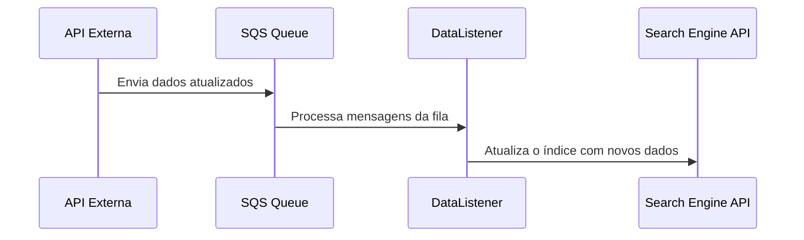

# Projeto AwesomeSync 🎩

Seja bem-vindo ao **AwesomeSync**, um sistema de sincronização de dados entre diferentes plataformas. Este projeto utiliza integrações com serviços de nuvem e APIs para garantir que tudo esteja atualizado e sincronizado.

---

## 📑 Sumário
- [Objetivo do Projeto](#objetivo-do-projeto)
- [Tecnologias Utilizadas](#tecnologias-utilizadas)
- [Estrutura do Projeto](#estrutura-do-projeto)
- [Configuração do Ambiente](#️-configuração-do-ambiente)
- [Como Rodar o Projeto](#como-rodar-o-projeto)
- [Diagrama de Fluxo de Sincronização](#diagrama-de-fluxo-de-sincronização)
- [Testes](#testes)
- [Variáveis de Ambiente para AWS Lambda](#variáveis-de-ambiente-para-aws-lambda)

---

## Objetivo do Projeto

O **AwesomeSync** foi criado para manter os dados sincronizados entre diferentes plataformas, como APIs de terceiros e mecanismos de busca. O foco é evitar inconsistências e reduzir a necessidade de atualizações manuais, mantendo a informação fluida e precisa.

---

## Tecnologias Utilizadas

Para tornar o **AwesomeSync** escalável e moderno, usamos uma stack poderosa e atual:

- **.NET 8.0**: Motor que roda a aplicação.
- **AWS Lambda e SQS**: Automação e comunicação entre os componentes.
- **Algolia Search API**: Busca rápida e eficiente.
- **Docker**: Para facilitar deploys e manter a infraestrutura leve.

---

## Estrutura do Projeto

Vamos organizar o código para que fique fácil de navegar. Aqui está uma visão geral das pastas e arquivos principais:

```plaintext
AwesomeSync/
├── src/
│   ├── ApiSyncService/             # API para sincronização de dados
│   ├── DataListener/               # Listener para tratar eventos de dados
│   └── CommonUtils/                # Ferramentas comuns, usadas em todo o sistema
├── docs/                           # Documentação adicional e guias de instalação
├── tests/                          # Testes unitários e de integração
└── README.md                       # Documentação principal do projeto
```

---

## ⚙️ Configuração do Ambiente

Para rodar o **AwesomeSync** com sucesso, você precisa definir algumas variáveis de ambiente:

| **Variável**               | **Descrição**                                     |
|----------------------------|---------------------------------------------------|
| `AWS_QUEUE_URL`            | URL da fila SQS onde são enviadas mensagens.      |
| `API_KEY_ALGOLIA`          | Chave da API do Algolia para a indexação.         |
| `AUTH_API_URL`             | URL de autenticação para API externa.             |

**Dica**: Defina essas variáveis no painel da AWS Lambda ou use um arquivo `.env` para rodar localmente.

---

## Como Rodar o Projeto

Siga esses passos pra configurar o **AwesomeSync** e colocar tudo pra rodar:

1. Clone o repositório:

    ```bash
    git clone https://github.com/seuusuario/awesomesync.git
    cd awesomesync
    ```

2. Instale as dependências:

    ```bash
    dotnet restore
    ```

3. Configure as variáveis de ambiente mencionadas acima.

4. Execute o projeto:

    ```bash
    dotnet run --project src/ApiSyncService
    ```

---

## Diagrama de Fluxo de Sincronização

Para entender como os dados se movem no **AwesomeSync**, criamos um diagrama de fluxo mostrando o caminho da informação pelo sistema:



---

## Testes

Testar é essencial! Para garantir que o **AwesomeSync** funcione conforme o esperado, temos testes de unidade e de integração. Rodar os testes é fácil:

```bash
dotnet test
```

---

## Variáveis de Ambiente para AWS Lambda

Para que o **AwesomeSync** rode como esperado em ambientes diferentes, aqui estão as variáveis de ambiente principais:

| **Variável**           | **Descrição**                                         |
|------------------------|-------------------------------------------------------|
| `AWS_QUEUE_URL`        | URL da fila SQS para mensagens.                       |
| `API_KEY_ALGOLIA`      | Chave de API para Algolia.                            |
| `AUTH_API_URL`         | URL de autenticação para API externa.                 |
| `APP_SECRET`           | Chave secreta para autenticação segura.               |

---

Esse é um modelo de README.md bem documentado e com as seções principais que fazem toda a diferença na experiência dos devs que vão trabalhar no projeto. 🥂
